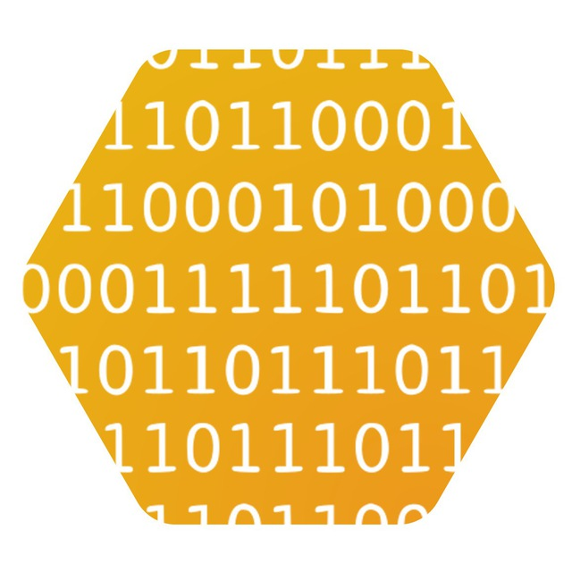

<br />
<p align="center">
  <a href="https://github.com/nimiq/nimiq-developer-center">
    
  </a>

<h1 align="center">
Nimiq's Developer Center
</h1>
<p align="center">
The Official documentation for the Nimiq ecosystem.<br>
Build and learn anything with Nimiq.
<p>

<p align="center">
  <a href="https://nimiq.com/" target="__blank"></a>
  <a href="https://nimiq.com/" target="__blank"></a>
</p>

<p align="center">
<a href="https://t.me/joinchat/AAAAAEJW-ozFwo7Er9jpHw"><b>Do you have any question? Ask us!</b></a>
</p>
<p align="center">
  <a href="https://nimiq.com/">Nimiq website</a> | <a href="https://discord.gg/cMHemg8">Discord</a> | <a href="https://t.me/joinchat/AAAAAEJW-ozFwo7Er9jpHw">Telegram</a>
</p>

## Contributing

Feel free to contribute if you want to improve any part of the docs. PRs all welcome!

### Do you have any question?

- Join our [Telegram](https://t.me/joinchat/AAAAAEJW-ozFwo7Er9jpHw) or [Discord](https://discord.gg/cMHemg8)
- Open an [issue](/issues/new)

## Set up

```bash
git clone https://github.com/onmax/nimiq-developer-center # Clone repo. You can also fork it and clone from your fork
cd nimiq-developer-center
pnpm install # Install pnpm first if you don't have it -> https://pnpm.io/installation
pnpm dev # Start dev server
```

## Writing Docs

After starting the server, you can start modifying the docs. The docs are written in Markdown, Frontmatter and Vue Components.

### Sidebar

The sidebar is defined in the [config.ts](/.vitepress/config.ts) file. You can see the options [here](https://vitepress.vuejs.org/guide/basic-config.html#config-file).

To reduce the amount of code we have to use to display the sidebar options, we have created some functions in the [sidebar.ts](/.vitepress/theme/utils/sidebar.ts) file.

#### Sidebar Header Section

It will create an element with the text and icon passed as parameters.

```ts
SidebarSectionHeader({ text: 'Protocol', icon: 'nodes', prefix: 'About the' })
```

#### Sidebar Items

It will create a list of items from the files in the folder passed as parameter. It receives an object of type `SidebarItemsOptions` which you can see in the [sidebar.ts](/.vitepress/theme/utils/sidebar.ts) file. You need to use the spread operator(`...`).

```ts
// Using the include option: it will display ONLY the files passed in the array
items: [...getFilesItemsFromFolder('learn/protocol', { include: ['overview', 'glossary', 'block-format'] })]

// Using the sort option: it will sort the files passed in the array and then it will include the rest of files in the folder
items: [...getFilesItemsFromFolder('learn/protocol', { sort: ['overview', 'glossary', 'block-format'] })]
```

#### Sidebar Accordion

It will create an expandable item with the files in the folder passed as parameter. It receives an object of type `SidebarAccordionOptions` which you can see in the [sidebar.ts](/.vitepress/theme/utils/sidebar.ts) file. The name it will be the folder name.

```ts
Accordion({ path: 'learn/protocol/validators' })
```

#### Single item with an icon

If you want to add a single item with an icon, you can use the `getItem` function. It receives an object of type `SidebarItem` which you can see in the [sidebar.ts](/.vitepress/theme/utils/sidebar.ts) file.

```ts
getItem({ text: 'Style Guide', link: 'https://www.figma.com/file/GU6cdS85S2v13QcdzW9v8Tav/NIMIQ-Style-Guide-(Oct-18)?type=design&node-id=0-1&mode=design&t=kLhdbJNNEnvBZrxV-0', icon: 'i-logos:figma' }),
```

### Markdown

Learn about basic Markdown syntax [here](https://docs.github.com/en/get-started/writing-on-github/getting-started-with-writing-and-formatting-on-github/basic-writing-and-formatting-syntax).

You can learn more about the Markdown syntax used in Vitepress [here](./markdown-examples.md).

#### Using custom banners

You can use custom banners to highlight important information using the following syntax:

<details>
<summary>Click to see syntax</summary>

```md
::: info
This is an info box.
:::

::: tip
This is a tip.
:::

::: warning
This is a warning.
:::

::: danger
This is a dangerous warning.
:::

::: details
This is a details block.
:::

::: goal
Getting started by building a minimal...
:::
```

</details>

### Frontmatter

Learn about Frontmatter [here](https://jekyllrb.com/docs/front-matter/). Frontmatter is used mainly for:

- Vitepress-specific to the page configuration. See options [here](https://vitepress.dev/reference/frontmatter-config#frontmatter-config) for more info.
- Adding arrays of [Custom Vue Components](#custom-vue-components) to the markdown files.

### Custom Vue Components

> [!WARNING]
> Only developers with knowledge of Vue.js should modify these components. If you need to use it, just copy and paste the code from the docs 🙂

#### Cards

> [!NOTE]
> Usually, you might want to use the [Links](#links) component instead of this one.

This component is used to create a single card. It receives a JSON object defined by the type `Card` which you can see in the [Card.vue](/.vitepress/theme/components/Card.vue) file.

#### Links

This component is used to create a grid of cards with links to other pages. It receives a list of cards which should be defined in the frontmatter section.

You can see an example in the [Home Page](/index.md).

#### Tags

A simple component to display a list of tag(s). It receives a list of tags which should be defined in the frontmatter section. You can use it like:

```md
<Tags :tags="['RPC']" /> <!-- Single tag -->
<Tags :tags="['RPC', 'Web Client']" /> <!-- Multiple tags -->
```

The list of valid tags is defined in the [Tags.vue](/.vitepress/theme/components/Tags.vue) file.

## Configuration

### Sidebar and Navigation

The sidebar and the navigation can be editted from the [config.ts](/.vitepress/config.ts) file. You can see the options [here](https://vitepress.vuejs.org/guide/basic-config.html#config-file).

> [!NOTE]
> Some options we use HTML for the text property instead of raw text. This allows us to implement a custom design for the sidebar and navigation.

## UnoCSS

We are using UnoCSS with [Attributify preset](https://unocss.dev/presets/attributify) and the [Icons preset](https://unocss.dev/presets/icons) which allow us to have the [icons](assets/icons) and then we can use them like:

```html
<div i-nimiq:iconst-lg-bulb></div>
```

### Why not just use TailwindCSS?

Basically, TailwindCSS scan

For more details, this [post](https://antfu.me/posts/windicss-and-tailwind-jit) is recommended.
