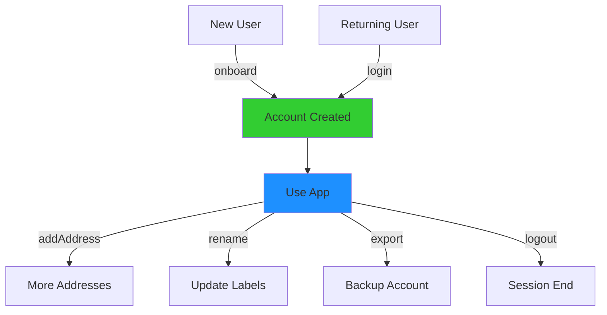

# Account Management

The Hub API provides comprehensive account management methods to onboard new users, handle authentication, and manage addresses. Most of these methods are **restricted to privileged origins** (Nimiq domains only) for security.

::: warning Restricted Methods
Account management methods like `onboard()`, `signup()`, `login()`, etc. are only accessible from **Nimiq domains** (`*.nimiq.com`) in the production Hub. Third-party apps should use:
- `signMessage()` for authentication
- `chooseAddress()` to get user addresses
- `checkout()` / `signTransaction()` for payments

If you're building a custom Hub instance, you can configure privileged origins in your Hub configuration.
:::

## onboard()

Guide new users through account creation with a friendly onboarding flow. This is the recommended method for user signup.

### Basic Usage

```ts
const accounts = await hubApi.onboard({
  appName: 'My App',
})

console.log('Created accounts:', accounts)
```

### Request Options

```ts
interface OnboardRequest {
  appName: string
  disableBack?: boolean // Disable back button during onboarding
}
```

### Response

```ts
interface Account {
  accountId: string // Unique account ID
  label: string // Account name/label
  type: AccountType // Account type (BIP39, Ledger, etc.)
  addresses: Address[] // Associated addresses
}

interface Address {
  address: string // Human-readable address (NQ...)
  label: string // Address label
}
```

### Example: First-Time User Flow

```ts
async function welcomeNewUser() {
  try {
    const accounts = await hubApi.onboard({
      appName: 'Welcome to My App',
      disableBack: true,
    })

    // User created one or more accounts
    const defaultAccount = accounts[0]
    const defaultAddress = defaultAccount.addresses[0]

    // Store user information
    await saveUserProfile({
      accountId: defaultAccount.accountId,
      address: defaultAddress.address,
      label: defaultAccount.label,
    })

    showWelcomeMessage(`Welcome, ${defaultAccount.label}!`)
    navigateTo('/dashboard')
  }
  catch (error) {
    if (error.message === 'Request was cancelled') {
      showMessage('Onboarding cancelled')
    }
    else {
      showError('Onboarding failed')
    }
  }
}
```

## signup()

Create a new account. Similar to `onboard()` but with less guidance.

### Basic Usage

```ts
const accounts = await hubApi.signup({
  appName: 'My App',
})
```

### Request Options

```ts
interface BasicRequest {
  appName: string
}
```

### Response

Returns an array of `Account` objects (same as `onboard()`).

### Example

```ts
async function createNewAccount() {
  const accounts = await hubApi.signup({
    appName: 'Account Manager',
  })

  const newAccount = accounts[0]
  console.log('New account created:', newAccount.label)
  console.log('Address:', newAccount.addresses[0].address)
}
```

## login()

Let users select an existing account to log in.

### Basic Usage

```ts
const accounts = await hubApi.login({
  appName: 'My App',
})

const selectedAccount = accounts[0]
console.log('Logged in as:', selectedAccount.label)
```

### Request Options

```ts
interface BasicRequest {
  appName: string
}
```

### Response

Returns an array of selected `Account` objects.

### Example: Login Flow

```ts
async function handleLogin() {
  try {
    const accounts = await hubApi.login({
      appName: 'My App',
    })

    if (accounts.length === 0) {
      showError('No account selected')
      return
    }

    const account = accounts[0]
    const address = account.addresses[0].address

    // Authenticate with your backend
    const response = await fetch('/api/auth/login', {
      method: 'POST',
      headers: { 'Content-Type': 'application/json' },
      body: JSON.stringify({
        accountId: account.accountId,
        address,
      }),
    })

    const { token } = await response.json()
    localStorage.setItem('authToken', token)

    showSuccess(`Welcome back, ${account.label}!`)
    navigateTo('/dashboard')
  }
  catch (error) {
    showError('Login failed')
  }
}
```

## logout()

Log out a user (clears session in Hub).

### Basic Usage

```ts
const result = await hubApi.logout({
  appName: 'My App',
})

console.log('Logged out successfully')
```

### Request Options

```ts
interface SimpleRequest {
  appName: string
}
```

### Response

```ts
interface SimpleResult {
  success: boolean
}
```

### Example

```ts
async function handleLogout() {
  try {
    await hubApi.logout({
      appName: 'My App',
    })

    // Clear local session
    localStorage.removeItem('authToken')
    localStorage.removeItem('userAddress')

    showMessage('Logged out successfully')
    navigateTo('/login')
  }
  catch (error) {
    showError('Logout failed')
  }
}
```

## export()

Allow users to export their account (backup words, keyfile, etc.).

### Basic Usage

```ts
const result = await hubApi.export({
  appName: 'My App',
  accountId: 'account-id',
})

console.log('Export complete')
```

### Request Options

```ts
interface ExportRequest {
  appName: string
  accountId: string // ID of account to export
}
```

### Response

```ts
interface ExportResult {
  success: boolean
}
```

::: info Security Note
The export operation is handled entirely within the secure Keyguard. Your application never receives the private keys or recovery words — users download them directly.
:::

### Example

```ts
async function exportAccountBackup(accountId: string) {
  try {
    await hubApi.export({
      appName: 'Account Manager',
      accountId,
    })

    showSuccess('Account exported successfully. Store your backup safely!')
  }
  catch (error) {
    if (error.message === 'Request was cancelled') {
      showMessage('Export cancelled')
    }
    else {
      showError('Export failed')
    }
  }
}
```

## rename()

Change an account or address label.

### Basic Usage

```ts
const account = await hubApi.rename({
  appName: 'My App',
  accountId: 'account-id',
  address: 'NQ07 0000 0000 0000 0000 0000 0000 0000 0000', // Optional
})

console.log('Renamed to:', account.label)
```

### Request Options

```ts
interface RenameRequest {
  appName: string
  accountId: string // Account to rename
  address?: string // If provided, renames address instead of account
}
```

### Response

Returns the updated `Account` object.

### Example

```ts
async function renameAccount(accountId: string) {
  try {
    const account = await hubApi.rename({
      appName: 'Account Settings',
      accountId,
    })

    showSuccess(`Renamed to "${account.label}"`)
    updateAccountDisplay(account)
  }
  catch (error) {
    if (error.message === 'Request was cancelled') {
      showMessage('Rename cancelled')
    }
  }
}

async function renameAddress(accountId: string, address: string) {
  try {
    const account = await hubApi.rename({
      appName: 'Account Settings',
      accountId,
      address,
    })

    // Find the renamed address
    const renamedAddr = account.addresses.find(a => a.address === address)
    showSuccess(`Address renamed to "${renamedAddr?.label}"`)
  }
  catch (error) {
    showError('Rename failed')
  }
}
```

## addAddress()

Add a new address to an existing account.

### Basic Usage

```ts
const newAddress = await hubApi.addAddress({
  appName: 'My App',
})

console.log('New address:', newAddress.address)
console.log('Label:', newAddress.label)
```

### Request Options

```ts
interface SimpleRequest {
  appName: string
}
```

### Response

```ts
interface Address {
  address: string // Human-readable address
  label: string // Address label
}
```

### Example

```ts
async function addNewAddress() {
  try {
    const address = await hubApi.addAddress({
      appName: 'Address Manager',
    })

    showSuccess(`New address created: ${address.label}`)
    displayNewAddress(address)
  }
  catch (error) {
    showError('Failed to add address')
  }
}
```

## changePassword()

Let users change their Keyguard password.

### Basic Usage

```ts
const result = await hubApi.changePassword({
  appName: 'Security Settings',
})

console.log('Password changed successfully')
```

### Request Options

```ts
interface SimpleRequest {
  appName: string
}
```

### Response

```ts
interface SimpleResult {
  success: boolean
}
```

### Example

```ts
async function updatePassword() {
  try {
    await hubApi.changePassword({
      appName: 'Account Security',
    })

    showSuccess('Password changed successfully')
  }
  catch (error) {
    if (error.message === 'Request was cancelled') {
      showMessage('Password change cancelled')
    }
    else {
      showError('Password change failed')
    }
  }
}
```

## IFrame-Only Methods

The following methods are only available via IFrame behavior from privileged origins:

### list()

Get a list of all user accounts.

```ts
const accounts = await hubApi.list()

console.log('User has', accounts.length, 'accounts')
accounts.forEach((account) => {
  console.log(`${account.label}:`, account.addresses.length, 'addresses')
})
```

**Only available from Nimiq domains via IFrame.**

### cashlinks()

Get all cashlinks associated with the user.

```ts
const cashlinks = await hubApi.cashlinks()

console.log('User has', cashlinks.length, 'cashlinks')
```

**Only available from Nimiq domains via IFrame.**

## Account Types

Accounts can be of different types:

```ts
enum AccountType {
  BIP39 = 1, // Standard accounts (24-word recovery)
  LEGACY = 2, // Legacy accounts
  LEDGER = 3, // Ledger hardware wallet
}
```

Check account type to provide appropriate features:

```ts
const account = accounts[0]

if (account.type === HubApi.AccountType.LEDGER) {
  console.log('Ledger wallet detected')
  showMessage('Please confirm on your Ledger device')
}
```

## Account Lifecycle

A typical account lifecycle in your app:



## Best Practices

### 1. Graceful Onboarding

Don't force onboarding immediately. Let users explore first:

```ts
async function getOrCreateAccount() {
  try {
    // Try login first (for returning users)
    const accounts = await hubApi.login({
      appName: 'My App',
    })

    return accounts[0]
  }
  catch (error) {
    // If login fails/cancelled, offer onboarding
    if (confirm('No account found. Create a new one?')) {
      const accounts = await hubApi.onboard({
        appName: 'My App',
      })
      return accounts[0]
    }
  }
}
```

### 2. Store Account References, Not Keys

Never try to store private keys. Store account IDs and addresses:

```ts
// ✅ Good: Store references
const userSession = {
  accountId: account.accountId,
  address: account.addresses[0].address,
  label: account.label,
}
localStorage.setItem('session', JSON.stringify(userSession))

// ❌ Bad: Never try to access private keys
// Private keys never leave the Keyguard!
```

### 3. Handle Multiple Addresses

Users may have multiple addresses per account:

```ts
function displayAccountAddresses(account: Account) {
  return account.addresses.map(addr => ({
    address: addr.address,
    label: addr.label || 'Unnamed Address',
  }))
}
```

### 4. Provide Export Reminders

Remind users to backup their accounts:

```ts
// On first login after account creation
if (isNewAccount && !hasExportedBefore) {
  showNotification(
    'Backup Your Account',
    'Export your recovery words to keep your account safe',
    () => hubApi.export({ appName: 'My App', accountId: account.accountId })
  )
}
```

## Alternative: signMessage() for Authentication

For third-party apps, use `signMessage()` instead of `login()`:

```ts
// Third-party apps should use this approach
async function authenticateUser() {
  // 1. Get user's address
  const { address } = await hubApi.chooseAddress({
    appName: 'My App',
  })

  // 2. Request signature for authentication
  const challenge = await getAuthChallenge() // From your server

  const { signature, signerPublicKey } = await hubApi.signMessage({
    appName: 'My App',
    message: `Sign in to My App\nChallenge: ${challenge}`,
    signer: address, // Use the chosen address
  })

  // 3. Verify on server and get session token
  const token = await verifyAndLogin(address, signature, challenge)
  return token
}
```

## Next Steps

- Explore [Advanced Features](/hub/guide/advanced) (Cashlinks, Swaps, Multi-chain)
- See [Practical Examples](/hub/examples)
- Check the complete [API Reference](/hub/api-reference)
