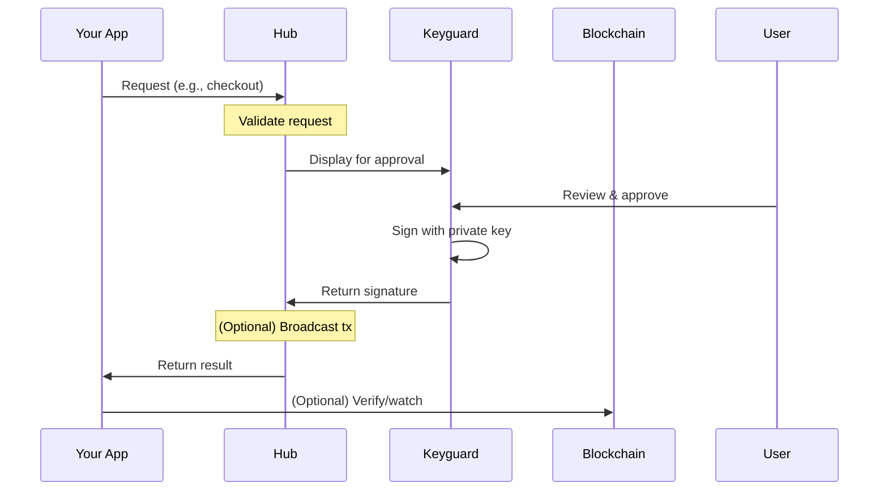
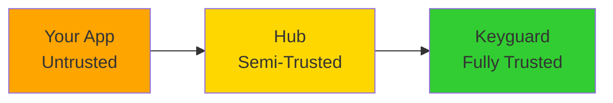

# Core Concepts

Understanding how the Hub works will help you integrate it effectively and choose the right request behavior for your application.

## Architecture Overview

The Nimiq Hub ecosystem consists of three main components:

```mermaid
graph TB
    A[Your Application] -->|Hub API Requests| B[Hub]
    B -->|Key Management| C[Keyguard]
    C -->|Signatures| B
    B -->|Results| A
    A -->|Transactions| D[Nimiq Blockchain]

    style A fill:#1F2348
    style B fill:#260133
    style C fill:#5F1A6F
    style D fill:#1F2348
```



### Your Application
The frontend application that integrates the Hub API to request wallet operations. This could be a dApp, payment platform, or any web application.

### Hub
The user-facing interface that displays transaction details, manages accounts, and coordinates between your app and the Keyguard. The Hub validates requests and presents them to users in a friendly UI.

### Keyguard
The secure, isolated component that holds private keys and performs all cryptographic operations. It's designed with maximum security in mind and never exposes private keys to the Hub or your application.

::: info Security by Design
The Keyguard runs in a separate origin and iframe with strict security policies. Private keys are encrypted with user passwords and never leave the Keyguard environment. Even if the Hub or your app is compromised, private keys remain safe.
:::

## Request Behaviors

The Hub API supports three different request behaviors to accommodate different application needs:

### Popup (Default)

The default and most common behavior. Requests open in a centered popup window.

```ts
const hubApi = new HubApi('https://hub.nimiq.com')
// Or explicitly use popup behavior
const popupBehavior = new HubApi.PopupRequestBehavior()
const hubApi = new HubApi('https://hub.nimiq.com', popupBehavior)

const result = await hubApi.checkout(options)
```

**Advantages:**
- Best user experience - users stay on your page
- Works on both desktop and mobile (new tab on mobile)
- Allows users to review and compare with your app simultaneously

**Limitations:**
- Can be blocked by popup blockers if not called in a user action
- May have issues with some browser extensions

**Best For:**
- Most web applications and dApps
- Payment checkouts
- Transaction signing

### Redirect

Redirects the entire browser tab to the Hub, then back to your app when complete.

```ts
const redirectBehavior = new HubApi.RedirectRequestBehavior()
const hubApi = new HubApi('https://hub.nimiq.com', redirectBehavior)

const result = await hubApi.checkout(options) // Will redirect
```

**Advantages:**
- Never blocked by popup blockers
- Works on all browsers and devices
- Simpler navigation flow on mobile

**Limitations:**
- Leaves your application temporarily
- Requires handling redirect callbacks
- **Requires HTTPS** in production (except localhost)

**Best For:**
- Mobile-first applications
- Single-page apps that can restore state
- Progressive web apps (PWAs)

::: warning HTTPS Required
Top-level redirects only work over HTTPS (except on localhost for development). Make sure your production app uses HTTPS before implementing redirect flows.
:::

#### Handling Redirect Responses

When using redirects, you need to listen for the Hub's return:

```ts
// 1. Initialize Hub with redirect behavior
const redirectBehavior = new HubApi.RedirectRequestBehavior('https://myapp.com/return')
const hubApi = new HubApi('https://hub.nimiq.com', redirectBehavior)

// 2. Set up listeners for each request type
hubApi.on(
  HubApi.RequestType.CHECKOUT,
  (result) => {
    console.log('Payment complete:', result)
  },
  (error) => {
    console.error('Payment failed:', error)
  }
)

// 3. Check for redirect response on page load
hubApi.checkRedirectResponse()

// 4. Later, trigger the request (will redirect)
button.addEventListener('click', () => {
  hubApi.checkout({ appName: 'My App', /* ... */ })
})
```

#### Preserving State Across Redirects

You can pass state data that will be preserved across the redirect:

```ts
const storedData = {
  orderId: '12345',
  userId: 'user_abc',
  returnPath: '/checkout/complete',
}

const redirectBehavior = new HubApi.RedirectRequestBehavior(
  'https://myapp.com/return',
  storedData
)

hubApi.on(
  HubApi.RequestType.CHECKOUT,
  (result, storedData) => {
    console.log('Order ID:', storedData.orderId) // '12345'
    console.log('Transaction:', result.hash)
  }
)
```

### IFrame (Restricted)

Some methods can be called via iframe for privileged origins (Nimiq domains only).

```ts
const iframeBehavior = new HubApi.IFrameRequestBehavior()

// Only available for specific methods from trusted origins
const accounts = await hubApi.list(iframeBehavior)
```

**Advantages:**
- Seamless integration without popups or redirects
- Instant responses

**Limitations:**
- **Only available from Nimiq domains** (e.g., `*.nimiq.com`)
- Limited to specific methods: `list()`, `cashlinks()`, `addBtcAddresses()`
- Not available for third-party applications

**Best For:**
- Official Nimiq applications like the Wallet
- Internal tools and services

::: info For Third-Party Developers
Unless you're building an official Nimiq app or running a custom Hub instance, you'll use **Popup** or **Redirect** behaviors. IFrame behavior is restricted to privileged origins for security reasons.
:::

## Request Lifecycle

Understanding the request lifecycle helps you handle loading states and errors properly:



1. **Request**: Your app calls a Hub API method in response to a user action
2. **Validation**: Hub validates the request parameters
3. **User Review**: Hub presents the request to the user in a clear UI
4. **Keyguard**: If approved, Keyguard signs with the private key
5. **Response**: Hub returns the result (or error) to your app
6. **Broadcast**: For some methods like `checkout()`, the transaction is broadcast automatically

## Security Model

### Trust Boundaries



- **Your App (Untrusted)**: Can request operations but never access private keys
- **Hub (Semi-Trusted)**: Validates and presents requests but never handles raw keys
- **Keyguard (Fully Trusted)**: Holds encrypted keys and performs signing in isolation

### What the Hub Does NOT Know

- Your users' private keys (only Keyguard has these, encrypted)
- User passwords (only Keyguard handles these)
- Keys are never transmitted to your app or the Hub

### What Your App Cannot Do

- Access private keys directly
- Sign transactions without user approval
- Impersonate the user
- Extract seeds or recovery phrases

::: tip Security Best Practice
Always display transaction details to your users **before** calling Hub methods. While the Hub shows details again, informed users make better security decisions.
:::

## Request Behaviors Comparison

| Feature | Popup | Redirect | IFrame |
|---------|-------|----------|---------|
| User stays on page | ✅ | ❌ | ✅ |
| Works on mobile | ✅ | ✅ | ✅ |
| Requires HTTPS | ❌ | ✅ | ❌ |
| Popup blocker risk | ⚠️ | ❌ | ❌ |
| State preservation | ✅ | Manual | ✅ |
| Third-party access | ✅ | ✅ | ❌ |
| Setup complexity | Low | Medium | Low |

## Choosing a Request Behavior

### Use Popup When:
- Building a standard web application
- User experience is a priority
- You can ensure calls happen in user actions

### Use Redirect When:
- Building a mobile-first app
- Simplicity is more important than staying on page
- You encounter consistent popup blocker issues
- Your app can restore state easily

### Use IFrame When:
- Building an official Nimiq application
- You control the Hub instance and can configure privileged origins

## Common Patterns

### Progressive Enhancement

Start with popups and fallback to redirects if needed:

```ts
let hubApi

try {
  // Try popup first
  const popupBehavior = new HubApi.PopupRequestBehavior()
  hubApi = new HubApi('https://hub.nimiq.com', popupBehavior)
  await hubApi.checkout(options)
}
catch (error) {
  if (error.message.includes('popup')) {
    // Fallback to redirect
    const redirectBehavior = new HubApi.RedirectRequestBehavior()
    hubApi = new HubApi('https://hub.nimiq.com', redirectBehavior)
    await hubApi.checkout(options)
  }
}
```

### Mobile Detection

Choose behavior based on device:

```ts
const isMobile = /iPhone|iPad|iPod|Android/i.test(navigator.userAgent)

const behavior = isMobile
  ? new HubApi.RedirectRequestBehavior()
  : new HubApi.PopupRequestBehavior()

const hubApi = new HubApi('https://hub.nimiq.com', behavior)
```

## Next Steps

- Learn [Integration Best Practices](/hub/guide/integration)
- Explore [Transaction Methods](/hub/guide/transactions)
- See [Practical Examples](/hub/examples)
