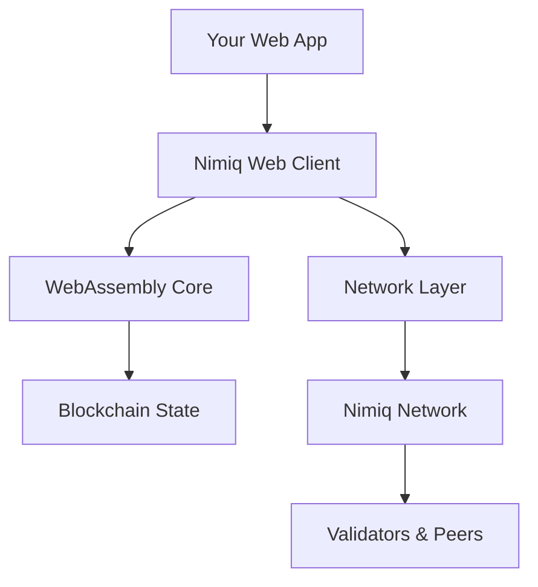

# Nimiq Web Client

Build blockchain applications that run entirely in the browser {.nq-subline .mt-0}

The Nimiq Web Client is a powerful TypeScript/JavaScript library that enables direct blockchain interaction from web browsers. Unlike traditional blockchain applications that require server infrastructure, Nimiq applications can run entirely client-side while maintaining full security and decentralization. {.mt-32}

## Quick Start

  <a href="./getting-started" nq-pill-blue nq-arrow>Getting Started</a>
  <a href="./installation" nq-pill-tertiary>Installation Guide</a>
  <a href="./integrations" nq-pill-tertiary>Framework Integrations</a>
  <a href="https://onmax.github.io/nimiq-ui/" nq-pill-tertiary target="_blank">UI Components</a>
  <a href="https://github.com/onmax/nimiq-mcp" nq-pill-tertiary target="_blank">AI MCP Server</a>

## What Makes It Special

The Nimiq Web Client transforms how blockchain applications are built and deployed:

- **Zero Infrastructure**: No servers, databases, or backend APIs required
- **Instant Deployment**: Deploy to any static hosting service (GitHub Pages, Netlify, Vercel)
- **Full Node Capabilities**: Your app becomes a light node in the Nimiq network
- **Native Browser Experience**: Works with standard web technologies and frameworks
- **AI-Powered Development**: Use the [Nimiq MCP Server](https://github.com/onmax/nimiq-mcp) to let AI assistants help you build and interact with Nimiq

<NqGrid f-my-xl :cards="$frontmatter.webClientFeatures" />

## Architecture Overview

The Web Client consists of several key components:

- **Core Engine**: WebAssembly-compiled blockchain logic for maximum performance
- **Network Layer**: P2P communication with the Nimiq network
- **Account Management**: Secure key handling and transaction signing
- **State Synchronization**: Efficient blockchain state updates

## Use Cases

### DeFi Applications
Build decentralized exchanges, lending protocols, and yield farming applications with real-time market data.

### NFT Marketplaces
Create, trade, and manage non-fungible tokens with integrated wallet functionality.

### Payment Solutions
Integrate cryptocurrency payments into e-commerce platforms and business applications.

### Gaming & Rewards
Develop blockchain games, loyalty programs, and reward systems with instant transactions.

## Next Steps

Ready to start building? Choose your path:

1. **New to Nimiq**: Start with our [Getting Started](/web-client/getting-started) guide
2. **Framework Integration**: Check out [framework-specific guides](/web-client/integrations)
3. **UI Components**: Explore [Nimiq UI](https://onmax.github.io/nimiq-ui/) for ready-to-use components
4. **API Reference**: Browse the complete [Web Client Reference](/web-client/reference/)

  <h3 text="f-lg" font-bold mb-12>Need Help?</h3>
  

    Join our developer community for support, discussions, and the latest updates.
  

  

    <a href="https://t.me/nimiq" nq-pill-tertiary target="_blank">Telegram Community</a>
    <a href="https://forum.nimiq.community/" nq-pill-tertiary target="_blank">Community Forum</a>
    <a href="https://github.com/nimiq" nq-pill-tertiary target="_blank">GitHub</a>
  

