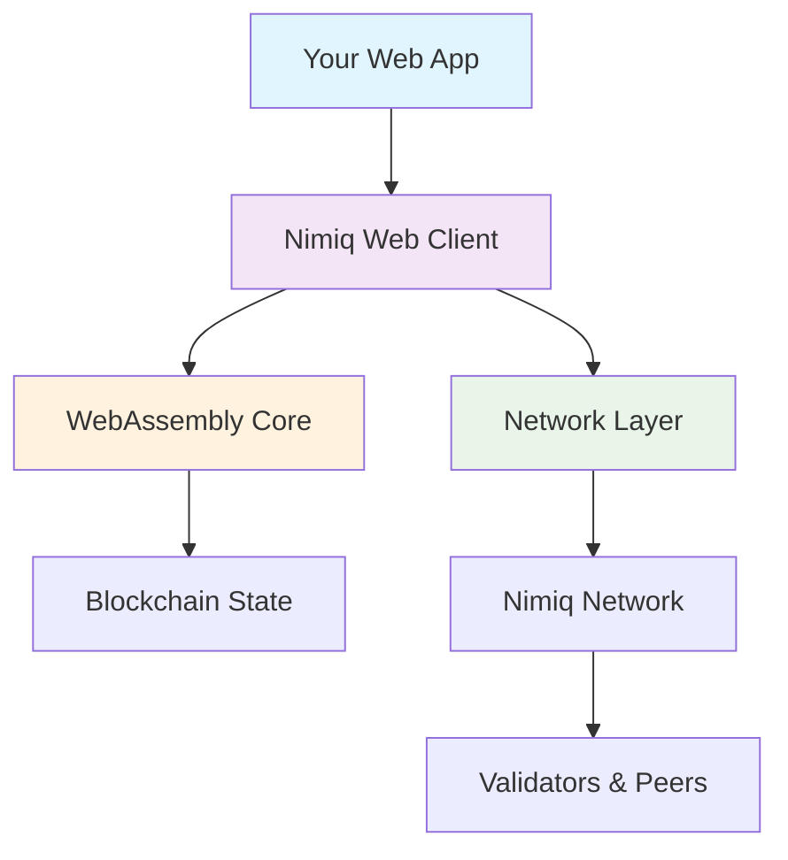

<Hero :title="$frontmatter.title" :description="$frontmatter.description" :cards="$frontmatter.heroCards" align="left" />

<WebClientExplainer />

<GetStartedSection />

<NimiqFeatures align="left" f-pb-3xl f-pt-2xl :title="$frontmatter.webClientFeaturesTitle" :description="$frontmatter.webClientFeaturesDescription" :label="$frontmatter.webClientFeaturesLabel" :features="$frontmatter.webClientFeatures" :show-borders="false" />

<QuickStart align="left" :title="$frontmatter.quickStartTitle" :description="$frontmatter.quickStartDescription" :label="$frontmatter.quickStartLabel" :actions="$frontmatter.quickStartActions" />

<PopularResources align="left" :label="$frontmatter.popularResourcesLabel" :title="$frontmatter.popularResourcesTitle" :description="$frontmatter.popularResourcesDescription" :resources="$frontmatter.popularResources" />

## Architecture Overview

The Nimiq Web Client transforms how blockchain applications are built and deployed by enabling direct browser-to-blockchain connections.

The Web Client consists of several key components:

- **Core Engine**: WebAssembly-compiled blockchain logic for maximum performance
- **Network Layer**: P2P communication with the Nimiq network
- **Account Management**: Secure key handling and transaction signing
- **State Synchronization**: Efficient blockchain state updates

## Use Cases

### DeFi Applications
Build decentralized exchanges, lending protocols, and yield farming applications with real-time market data and zero infrastructure costs.

### Payment Solutions
Integrate cryptocurrency payments into e-commerce platforms and business applications with instant confirmations and no fees.

### NFT Marketplaces
Create, trade, and manage non-fungible tokens with integrated wallet functionality and seamless user experience.

### Gaming & Rewards
Develop blockchain games, loyalty programs, and reward systems with instant transactions and client-side security.

  <h3 text="f-lg" font-bold mb-12>Need Help?</h3>
  

    Join our developer community for support, discussions, and the latest updates.
  

  

    <a href="https://t.me/nimiq" nq-pill-tertiary target="_blank">Telegram Community</a>
    <a href="https://forum.nimiq.community/" nq-pill-tertiary target="_blank">Community Forum</a>
    <a href="https://github.com/nimiq" nq-pill-tertiary target="_blank">GitHub</a>
  

